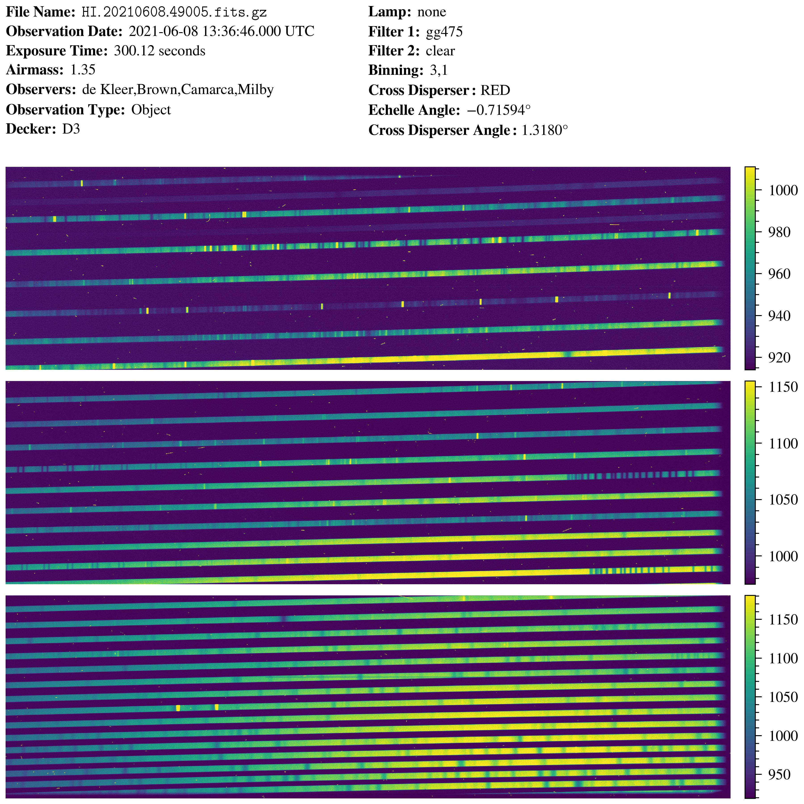

# `hirespipeline`: A Keck/HIRES Data Reduction Pipeline
I'm writing this README text in December 2022. For some reason, despite being 
one of the most productive instruments at the Keck observatory on Mauna Kea, 
the HIRES[^2] instrument does not have a standard data reduction pipeline. 
There are some exoplanet-specific pipelines which aren't really public, a 
limited-use automatic one that doesn't produce science-quality results (and has 
failed on all of my recent data sets) and some very old IDL-based pipelines 
that also no longer seem to work and are no longer supported by their authors. 
Similarly, the ``PypeIt`` package[^1], intended by its designers to be the 
standard spectroscopic data reduction pipeline for Python, does not (yet) have 
HIRES support.

This repository contains my attempt at making an automated pipeline for 
reducing Keck HIRES observations. I built it primarily for a Galilean satellite 
aurora project I work on at Caltech with Katherine de Kleer, Mike Brown and 
Maria Camarca and a collaborator at Boston University Carl Schmidt. I've 
cobbled together many ideas and components from a variety of sources including 
the Mauna Kea Echelle Extraction ``MAKEE`` package[^3] and the ``HIRedux`` IDL 
reduction pipeline [^4] written by Jason X. Prochaska.

If all goes well, this pipeline will:
1. Detect each order and its bounds, including those crossing between
   detectors,
2. Reduce the science frames by subtracting the bias, flat-fielding and
   gain-correcting,
3. Automatically calculate a wavelength solution for each extracted order, and
4. Save the result for easy access and/or archiving (as a FITS file appended 
   with the extension `_reduced`).

I don't yet know if this will work without modification for other types of 
HIRES data (I imagine the use of different filters may change how well it 
operates). However, in the scientific spirit, I've made this repository public 
so anyone can take and modify what I've done here.

**Update February 15, 2023:** It ran successfully *without modification* on a 
set of Jupiter observations taken by a colleague.

[^1]: https://pypeit.readthedocs.io/en/release/
[^2]: https://www2.keck.hawaii.edu/inst/hires/
[^3]: https://sites.astro.caltech.edu/~tb/makee/
[^4]: https://www.ucolick.org/~xavier/HIRedux/

## Installation
I've used this code successfully on a Mac running macOS Monterey and Ventura 
through an Anaconda virtual environment running Python 3.10.6. If I were you, I 
would install this in a virtual environment running Python 3.10 (or newer) so 
you don't mess up any of your other projects.

Here are some installation instructions for the average Anaconda user, if 
you're more advanced I'm sure you can figure it out from here.
1. \[Optional/Recommended\] Create a virtual environment (I've named it
   `hires_reduction` in the example):<br>
   `% conda create --name hires_reduction python=3.10`
2. Activate your virtual environment:<br>
    `% conda activate hires_reduction`
3. Install the `hirespipeline` package and its dependencies:<br>
    `% python -m pip install git+https://github.com/zachariahmilby/keck-hires-pipeline.git`

## Generating Quicklooks
I've written a function which will generate graphical quicklooks in a provided
directory containing FITS files. It will also save a summary CSV file you can
use for a general overview of the data in your directory. This can be useful 
for sorting your files (necessary for running the pipeline, see below). To use 
it, just provide a path to a directory which contains FITS files.
```
>>> from hirespipeline import create_quicklooks
>>> create_quicklooks('/path/to/directory')
```
This will produce a quicklook that looks like this:


## Running the Pipeline
This package has a single class with a single public method, so there isn't too
much you have to do as a user. To begin, simply import the class
```
>>> from hirespipeline import HIRESPipeline
```
I've sorted my data into a directory I've named `selected`, within which I've 
placed a number of sub-directories containing the respective FITS files. Though 
you don't have to use the name `selected` for the parent directory, the 
directory structure within must have subdirectories with the following names 
containing the bias, flat, arc and trace files. The trace file can be any 
bright, point-source (or nearly-point-source) object taken with the same
detector setup. For my aurora work, this is often one of the Galilean 
satellites. Other people have used a standard calibration star. There can be 
multiple `science` directories containing actual observations, and you can name 
them whatever you want because you have to directly point to them. 
```
selected
│
└─── bias
│    │    file01.fits.gz
│    │    file02.fits.gz
│    │    ...
│   
└─── flat
│    │    file01.fits.gz
│    │    file02.fits.gz
│    │    ...
│   
└─── arc
│    │    file01.fits.gz
│    │    file02.fits.gz
│    │    ...
│
└─── trace
│    │    file01.fits.gz
│    │    file02.fits.gz
│    │    ...
│
└─── science
│    │    file01.fits.gz
│    │    file02.fits.gz
│    │    ...
```
Finally, to run the pipeline on a science sub-directory, create a pipeline 
object with the name of the observation target, filepath (relative or absolute) 
to the `selected` directory, and the name of the sub-directory containing the 
science data.
```
>>> pipeline = HIRESPipeline(target='Ganymede', 
                             file_directory='/path/to/selected',
                             science_subdirectory='science')
>>> pipeline.run()
```
The `target` keyword can be either a string or a list of strings if you want
to process multiple directories. For each target, you'll have to specify a 
directory under the `science_subdirectory` keyword, which should also be either
a string or a list of strings. The `file_directory` keyword points to the 
`selected` directory as defined above.

> **CAUTION**<br>
> The pipeline assumes you are using files downloaded from the Keck Observatory
> Archive with unique filenames, e.g., "HI.20210608.49901.fits.gz". If you are
> using data with non-unique filenames, e.g., "hires00001.fits", you will have 
> to supply several additional keyword arguments when you instantiate the 
> `HIRESPipeline` class, because they are added to the FITS headers when they
> are processed by the archive. They include:
> 1. `slit_length`: the length of the slit you chose in arcseconds,
> 2. `slit_width`: the width of the slit you chose in arcseconds,
> 3. `spatial_binning`: the spatial binning you chose (probably 2 or 3),
> 4. `spectral_binning`: the spectral binning you chose (almost certainly 1), 
>     and
> 5. `gain`: the detector gains, either "low" (the HIRES default) or "high".

Running the pipeline with the `.run()` method will save the reduced science 
data in a `reduced` directory on the same level as `selected`. It also includes 
a few quality-assurance graphics showing the traces, echelle order bounds, and 
identified order numbers and wavelength bounds so you can see if it worked well 
or not.

The pipeline performs the following reduction steps (and propagates error 
appropriately at each step):
1. Create and subtract master bias,
2. Create and divide by a normalized master flat field,
3. Rectify orders,
4. Calculate wavelength solution, and
5. Set flux to an airmass of zero by removing wavelength-dependent extinction 
   as described in Buton et al. (2003)[^5].

> **NOTE**<br>
> The wavelength solution should be accurate to within one slit width or so. If
> you are looking for a precise wavelength solution, you will want to identify 
> some known features and calculate a precise offset.

It saves the master bias, master flat and master arc as FITS files, along with
quality assurance graphics so you can see what they look like. For each of the
targets and science subdirectories you've specified, it will save reduced data
(also as FITS files) and a corresponding quality assurance graphic in 
appropriately-named directories. The FITS file headers for each extension hold 
important observational information. The quality assurance graphics also 
include the wavelength solution and the polynomial fit for you to judge the 
quality. The resulting file structure looks something like this:

```
reduced
│
│    master_arc.fits.gz
│    master_bias.fits.gz
│    master_flat.fits.gz
│
└─── quality_assurance
│    │    master_arc.jpg
│    │    master_flat.bias
│    │    master_flat.jpg
│    │    order_edges.jpg
│    │    order_traces.jpg
│    │
│    └─── wavelength_solutions
│    │    │    order01.jpg
│    │    │    order02.jpg
│    │    │    ...
│
└─── science
│    │    file01_reduced.fits.gz
│    │    file01_reduced.jpg
│    │    file02_reduced.fits.gz
│    │    file02_reduced.jpg
│    │    ...
```

[^5]: Buton, C., et al. (2012), Atmospheric extinction properties above Mauna 
      Kea from the nearby Supernova Factory spectro-photometric data set, 
      Astronomy & Astrophysics, 549, doi:10.1051/0004-6361/201219834
